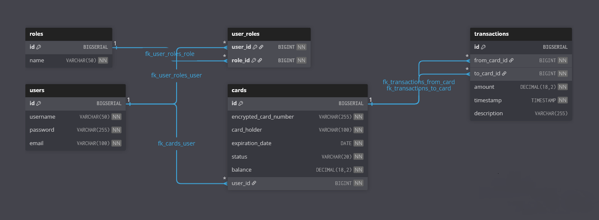

<h1 align="center">Bank_REST — банковское REST‑приложение</h1>

Кроссплатформенный backend на Spring Boot для управления банковскими картами, пользователями и переводами. Проект включает безопасность (Spring Security + JWT), шифрование номеров карт (AES), аудит операций, поиск/фильтрацию и документацию OpenAPI.

<h2 align="center">Возможности</h2>
- Управление картами: создание, просмотр, обновление, удаление
- Генерация и валидация номеров карт (алгоритм Луна), уникальность
- Шифрование номеров карт (AES), маскирование при выводе
- Управление статусами карт: активна/заблокирована/истекла, планировщик истечения
- Переводы между картами с валидацией статуса и баланса (транзакционность)
- История (аудит) событий и переводов
- Пользователи и роли (ADMIN/USER), ограничение доступа по ролям и владению
- Поиск/фильтрация/сортировка и пагинация результатов
- Глобальная обработка ошибок и валидация DTO

<h2 align="center">Архитектура (вкратце)</h2>
- Сущности: `User`, `Card`, `Transfer`, `History` (+ `Role`, `CardStatus`)
- Связи: `User 1..* Card`, `Card 1..* Transfer (from/to)`, `History` с ссылками на `User/Card/Transfer`
- Слои: Controller → Service → Repository; мапперы и DTO, спецификации для поиска
- Безопасность: JWT, фильтр аутентификации, проверка прав на уровне контроллеров/сервисов
- Планировщик: автоматическая пометка истёкших карт

<h2 align="center">База данных и миграции</h2>

<p align="center">
  
</p>

- СУБД: PostgreSQL (по умолчанию)
- Миграции: Liquibase (`src/main/resources/db/changelog/db.changelog-master.yaml`)
- Ключевые таблицы: `users`, `cards`, `transfers`, `history`

<h2 align="center">Документация API</h2>
- Swagger UI: `http://localhost:8081/swagger-ui/index.html`
- OpenAPI JSON: `http://localhost:8081/v3/api-docs`
- OpenAPI YAML: `http://localhost:8081/v3/api-docs.yaml`

<h2 align="center">Быстрый старт (локально)</h2>
Требования: JDK 17+, Maven 3.9+

Запуск (через Maven wrapper):

```bash
# macOS/Linux/Git Bash
./mvnw spring-boot:run
```

```bat
:: Windows (cmd)
mvnw.cmd spring-boot:run
```

После старта приложение доступно на:
- http://localhost:8081

Альтернатива: сборка JAR и запуск:

```bash
# macOS/Linux/Git Bash
./mvnw -DskipTests package
java -jar target/Bank_REST-0.0.1-SNAPSHOT.jar
```

```bat
:: Windows (cmd)
mvnw.cmd -DskipTests package
java -jar target\Bank_REST-0.0.1-SNAPSHOT.jar
```

<h2 align="center">Запуск через Docker Compose</h2>
Требования: Docker Desktop (Windows/macOS) или Docker Engine (Linux) с Docker Compose v2.

1) (Опционально) создайте файл `.env` рядом с `docker-compose.yml`:

```dotenv
POSTGRES_DB=bank_rest
POSTGRES_USER=postgres
POSTGRES_PASSWORD=password
SERVER_PORT=8081
CARD_ENCRYPTION_KEY=1234567890abcdef
JWT_SECRET=yourSecretKeyyourSecretKeyyourSecretKey
JWT_EXPIRATION_MS=86400000
```

2) Соберите и поднимите контейнеры:

```bash
docker compose build
docker compose up -d
```

3) Проверка состояния и логов:

```bash
docker compose ps
docker logs -f bank_rest_app
```

Приложение: http://localhost:8081

Остановить и удалить контейнеры/volume:

```bash
docker compose down -v
```

<h2 align="center">Переменные окружения</h2>
- `SPRING_DATASOURCE_URL` (по умолчанию: `jdbc:postgresql://localhost:5432/bank_rest`)
- `SPRING_DATASOURCE_USERNAME`, `SPRING_DATASOURCE_PASSWORD`
- `SERVER_PORT` (по умолчанию `8081`)
- `CARD_ENCRYPTION_KEY` — 16/24/32 байта для AES (обязательно в проде)
- `JWT_SECRET` — секрет для подписи JWT (обязательно в проде)
- `JWT_EXPIRATION_MS` — TTL токена в миллисекундах

<h2 align="center">Тестирование</h2>
Запуск всех тестов:

```bash
# macOS/Linux/Git Bash
./mvnw test
```

```bat
:: Windows (cmd)
mvnw.cmd test
```

Интеграционные тесты покрывают контроллеры, миграции Liquibase, безопасность и бизнес‑логику переводов/карт.

<h2 align="center">Структура проекта (выдержка)</h2>
- `src/main/java/com/example/bankcards` — код приложения (контроллеры, сервисы, репозитории, безопасность, мапперы)
- `src/main/resources` — конфигурация (`application.yml`), Liquibase (`db/changelog`), схема БД (`db_structure.png`)
- `docs/` — OpenAPI и сопутствующая документация
- `docker-compose.yml`, `Dockerfile` — инфраструктура для dev‑среды

<h2 align="center">Безопасность и конфиденциальность</h2>
- Никогда не храните реальные секреты в репозитории. Для prod используйте Secret Manager/переменные окружения.
- Номера карт хранятся только в зашифрованном виде; при выводе используются маски.

<h2 align="center">Лицензия</h2>
Проект предоставляется "как есть" для учебных целей.
